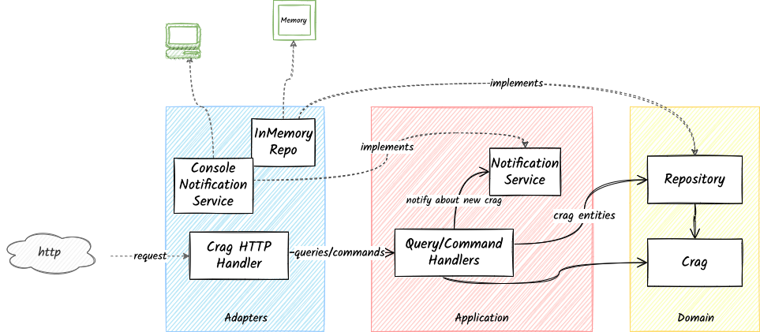

# Go Climb - Clean Architecture Example in Go
[](https://github.com/pkritiotis/go-climb/actions/workflows/build-test.yml)
[](https://goreportcard.com/report/github.com/pkritiotis/go-climb)
[](https://github.com/pkritiotis/go-climb/actions/workflows/lint.yml)

This is a sample project demonstrating an example of clean architecture in go. Detailed description in my blog post: https://pkritiotis.io/clean-architecture-in-golang/


# Code Design


# Application Overview

### Use Cases
As a **web client**, I want to be able to
* Get all available crags.
* Get a crag by ID.
* Add a crag by providing a name, country, and description.
* Update a crag by providing a name, country, and description.
* Remove a crag by ID.

As an **application administrator**
* When a new crag is added, I want to receive a notification at a pre-agreed channel.

### Technical requirements
* Operations should be exposed via an HTTP restful interface.
* For *simplicity* purposes,
    * The crags should be stored in memory; no need for persistence storage.
    * Notifications should be sent in a console application.

**Project Structure**

Go Climb follows the group-by-layer structure:

```bash
├── go-climb
│   ├── cmd/
│   ├── docs/
│   ├── internal
│   ├── app
│   │   ├── crag
│   │   │   ├── commands
│   │   │   └── queries
│   │   ├── notification
│   │   │   ├── mock_notification.go
│   │   │   └── notification.go
│   │   ├── services.go
│   │   └── services_test.go
│   ├── domain
│   │   └── crag
│   │       ├── crag.go
│   │       ├── mock_repository.go
│   │       └── repository.go
│   ├── inputports
│   │   ├── http
│   │   │   ├── crag
│   │   │   └── server.go
│   │   └── sevices.go
│   ├── outputadapters
│   │   ├── notification
│   │   │   └── console
│   │   ├── services.go
│   │   └── storage
│   │       ├── memory
│   │       └── mysql
|   │   └── pkg
|   │       ├── time/
|   │       └── uuid/
│   └── vendor/
```
- `cmd` contains the `main.go` file, the entry point of the application
- `docs` contains documentation about the application
- `internal` contains the main implementation of our application. It consists of the three layers of clean architecture + shared utility code under `pkg/`
    - infra
        - outputadapters
        - inputports
    - app
    - domain
    - pkg

  Each of these directories contains its corresponding components, following the group-by-feature approach.
- `vendor` contains the dependencies of our project

Great, we know how the high-level project structure of Go Climb. Let's explore the contents of each layer.


# Developer's Handbook
```makefile
make run  ## Run the application
make lint  ## Perform linting
make test  ## Run unit tests
make build  ## Build the app executable for Linux
make fmt  ## Format the source code
```